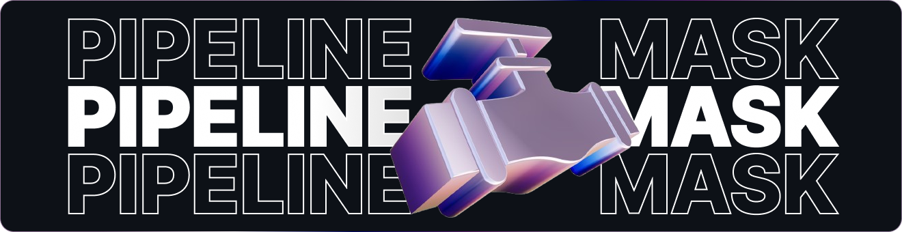

# Pipeline Mask

이 저장소는 다수 인원이 포함된 동영상을 1명에 대한 동영상으로 마스킹 및 분리하는 모듈을 제공합니다.

### Note

모든 테스트는 다음 환경에서 진행되었습니다. 일부 환경에서는 버전 호환성 확인이 필요할 수 있습니다.

    CPU: Intel(R) Core(TM) i9-13900KF
    GPU: Nvidia GeForce RTX 4090, CUDA 12.1
    OS: Ubuntu 24.04 LTS
    Conda: 25.5.1

## Installation

이 저장소에서 제공하는 모듈을 실행하기 위해 Conda 기반 환경을 구성합니다.

만약, Conda가 설치되어 있지 않다면 아래 링크에 접속하여 설치 후 단계를 진행합니다.

[🔗 아나콘다 다운로드](https://www.anaconda.com/download/success) 또는 [🔗 미니콘다 다운로드](https://www.anaconda.com/docs/getting-started/miniconda/main)

**Step 1**. Conda 가상환경 생성 및 활성화

```bash
conda create --name ngc-pipe-mask python=3.12 -y
conda activate ngc-pipe-mask
```

**Step 2**. 라이브러리 설치

```bash
pip install ultralytics
```

**Step 3**. 모델 가중치 다운로드

아래 링크에서 다운로드 받은 가중치 파일을 `root/model`디렉토리에 위치시킵니다.

-   **객체 검출 모델**: YOLO11 ( Download Link: [yolo11x.pt](https://github.com/ultralytics/assets/releases/download/v8.3.0/yolo11x.pt) )
-   **세그멘테이션 모델**: SAM 2 ( Download Link: [sam2.1_b.pt](https://github.com/ultralytics/assets/releases/download/v8.3.0/sam2.1_b.pt) )

## Directory Structure

```
.
├── data
│   ├── input           : 원본 동영상 디렉토리
│   ├── working         : 작업 디렉토리
│   └── output          : 마스킹된 동영상 디렉토리
├── model               : 모델 가중치 디렉토리
└── run.py              : 메인 코드
```

## Run

마스킹 및 분리할 동영상을 `data/input`디렉토리에 위치시킨 후, 아래 명령어를

```bash
python run.py
```
